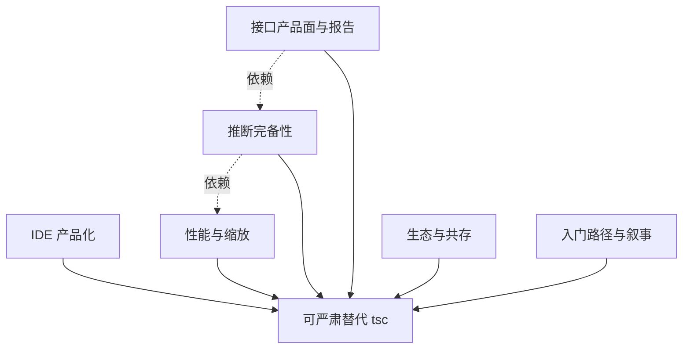

# Close TS DX Gaps — 技术缺口任务列表

> **状态**：路线图（未开工）。本文把「Nudo vs TypeScript 开发体验对比」讨论中
> **可补齐的技术缺口**收敛成可执行任务，不复述已实现设计。
>
> **真理源关系**：
> - 类型本体仍是 Abs（[`design-kernel-merge.md`](../../design-kernel-merge.md)）
> - 接口主路径见 [`design-refine-derivation.md`](../../design-refine-derivation.md)
> - 精度边界与既有未完成项见 [`design-limitations.md`](../../design-limitations.md)
> - 缓存/缩放见 [`design-persistent-cache.md`](../../design-persistent-cache.md)
> - HOF 关系见 [`design-hof-relations.md`](../../design-hof-relations.md)
>
> **定位共识**（讨论结论）：以「替代 TypeScript」为方向是合理的——尤其 JS 优先、
> 契约/精化重要、不想养第二门类型语言的项目。当前差距主要是 **IDE 产品化、
> 缩放、生态覆盖、推理完备性**；其中多数是工程债，不是原理禁区。
>
> **已拍板（2026-05-28）**：**移除 body 静态推 slot 的 `arg-structure` 门禁**。
> 无显式契约 ≠ 无契约；契约只来自「显式 interface」或「调用点事实」；无证据 → `any`。
> 详见 [§0.1 契约模型](#01-契约模型已拍板移除-body-slot-门禁) 与任务 **C0**。

---

## 0. 目标与非目标

### 目标

1. **日用 DX 达到「可严肃替代 tsc」的门槛**：IDE 默认可用、大仓可扩展、常见 JS 模式不掉 `unknown`。
2. **叙事与实现对齐**：主路径是 interface 下推 + 调用点事实；**不**从 body AST 预扫描发明义务。
3. **性能可被客观衡量**：cold / warm / edit-invalidate / scaling 四指标进 CI gate。
4. **报告对人可用、对 agent 可编程**：默认短报告；Abs 无损面可选。

### 非目标

- 不做 TypeScript 语法兼容层（条件类型、模板字面量类型语言等）。
- 不把 `.d.ts` 投影当主类型模型（仍是兼容侧信道）。
- 不在本路线图里承诺「一键迁移大 TS monorepo」——那是后续产品问题。
- 不重写内核为第二套类型系统。
- **不保留** body 访问 → 必填 slot 的 AST 预扫描（见 §0.1）。

### 0.1 契约模型（已拍板：移除 body slot 门禁）

**问题**：`collectParamStructReqs`（`packages/core/src/algebra/scan.ts`）从函数 body
扫 `p.foo` 成「必填 slot」，再对调用点报 `nudo:arg-structure`。这是第二套不完整
静态分析：守卫启发式、方法名白名单、`__esModule` 特例……实现读了什么 ≠ 调用方义务。

**契约永远存在，但只来自：**

| 来源 | 角色 | 检查义务 |
|---|---|---|
| 显式 interface（`*.nudo.js` / `@nudo:refine`） | **义务** | `constraint-violated` / shape 违例 |
| 调用点观察（join） | **事实**（隐式域） | 展示 / drift；**不**对其他站点强制 |
| 无证据 | **any** / `entry@` | 不发明义务 |

**移除后仍保留：**

- HOF 关系检查 `checkHofFnRelArgs`（回调可调用性 / arity，来自 `fnRels`，非 body 字段扫）
- `nudo:assign-mismatch`（赋值/绑定形状一致性）
- 求值路径真实失败（`unknown-recv` / no-method 等）——用实参跑 body，不是 AST 预扫

**明确不回退到 AST 扫描**：若 recall 不够，只允许「求值驱动」的缺失诊断，不允许
重新引入 body → 必填 slot。

**迁移面**：`scan.ts` 实现、`structure/arg-structure.js`、`vs-ts/structure`、gold /
zero-FP、`nudo-check.md` / website / README 对比表。见 **C0**、**D1**、**F3**。

### 成功判据（总览）

| 判据 | 度量 |
|---|---|
| 新人 30 分钟上手 | 无指令 JS 跑通 infer + IDE hover；一条侧车契约报出违例 |
| 契约模型一致 | 代码/文档/示例均不再推销「body 推必填 slot」 |
| IDE 日用 | 打开普通 `.js` 无需手动加指令即有诊断/补全（可配置） |
| 缩放 | 200 函数 warm 分析不慢于 tsc LS invalidated 同量级；400 函数有缓存命中 |
| 完备性 | 真实包 zero-FP 套件扩展到 Map/Set/循环常见模式且 FP 仍为 0 |
| CI gate | `bench-vs-tsc` 指标回退时 CI 红 |

---

## 1. 工作流总览

| 工作流 | 一句话 | 优先级 |
|---|---|---|
| [A. IDE 产品化](#a-ide-产品化) | 无指令文件默认进引擎；LSP 对齐日用 | **P0** |
| [B. 性能与缩放](#b-性能与缩放) | 缓存/增量 + 客观 bench gate | **P0** |
| [C. 推断完备性](#c-推断完备性) | **C0 删 body slot**；Map/Set/循环/闭包/catch/`==` | **P0–P1** |
| [D. 接口产品面与报告](#d-接口产品面与报告) | interface-first 叙事落地 + 报告打磨 | **P1** |
| [E. 生态与共存](#e-生态与共存) | dts/vite/编辑器/与 TS 并存 | **P1–P2** |
| [F. 入门路径与叙事](#f-入门路径与叙事) | 概念分层、文档、对照示例纠偏 | **P1** |

---

## A. IDE 产品化

> **缺口**：VS Code 扩展对**无 `@nudo:` 指令的文件不分析**——「零注解推断」只在
> CLI 故事里成立，IDE 卖点被砍半（`guides/vscode.md` 文件检测条件）。

| ID | 任务 | 验收 | 依赖 | 状态 |
|---|---|---|---|---|
| A1 | **默认分析策略**：无指令 `.js` 也可被 LSP 分析（项目级开关，默认 on 或首次提示） | 打开普通 JS 文件有 hover/inlay；无指令诊断可配置静音 | — | [ ] |
| A2 | **分析范围配置**：`package.json#nudo` 或 `.nudo/config`：include/exclude、只分析有侧车/exported、噪声档位 | 文档化配置；默认 exclude `node_modules` | A1 | [ ] |
| A3 | **无指令文件的噪声控制**：implicit 推断只报 high-confidence；`unknown` 叶子默认不刷屏 | 无指令文件打开 1s 内无 warning 风暴 | A1, A2 | [ ] |
| A4 | **侧车未保存 buffer**：LSP 可对打开中的 `*.nudo.js` 生效（设计 §2.2 Phase 1 缺口） | 编辑侧车未保存时 check/hover 同步 | design-refine-derivation | [ ] |
| A5 | **跨文件导航补齐**：侧车绑定名的 Go-to-Definition（源码 ↔ `*.nudo.js`）、Find References 含契约边 | F12 从 `add2` 到侧车契约可跳 | A1 | [ ] |
| A6 | **Quickfix / Code Action 扩展**：缺 slot → 插入侧车 shape；refine 违例 → 放宽契约/改实参建议 | 两类一键修复可用 | D2 | [ ] |
| A7 | **语义高亮与 inlay 对齐 interface 档**：default 走 symbolic（设计 Phase 1 已提），与 CodeLens 切换一致 | CodeLens `● interface` 与 hover 同源 | design-refine-derivation | [ ] |
| A8 | **大文件防抖与取消**：分析可取消；编辑风暴下不排队爆炸 | 快速输入 50 字符无卡死 | B2 | [ ] |

**相关代码锚点**

- `packages/vscode/package.json` activationEvents / 文件检测
- `packages/lsp/src/server.ts` capabilities、`documents.onDidOpen/Change`
- `packages/service` analyzer 入口

---

## B. 性能与缩放

> **现状**：`benchmark/micro/bench-vs-tsc.mts` 已证明 **小文件 warm Nudo 大幅领先**
> （~0.001ms vs tsc LS ~15–18ms）；**200–400 函数时 Nudo 变慢**（400 fn ~73ms vs ~28ms）。
> 任务是把优势钉进产品路径，并补缩放。

| ID | 任务 | 验收 | 依赖 | 状态 |
|---|---|---|---|---|
| B1 | **把 micro bench 升格为 CI gate**：cold / warm / LS-invalidated / scaling 曲线；回退阈值失败即红 | `pnpm run benchmark:gate` 进 CI | 现有 bench | [ ] |
| B2 | **编辑路径增量**：按文件脏标记 + 依赖边失效（隐式侧车边已在设计 §4.5）；避免整文件 Full sync 重算 | 单字符编辑 warm 分析 < 5ms（中位文件） | design-persistent-cache | [ ] |
| B3 | **`effectiveInterface` 跨会话缓存落地**（设计 Phase B） | 二次启动契约读取命中磁盘缓存 | design-persistent-cache | [ ] |
| B4 | **polyvariant 预算**：调用点/实例化上限 + 可配置 widen；超限可预测降级 | 400 函数缩放曲线不劣于 tsc LS 同档；超限有可解释 `#widened` | C 系列 | [ ] |
| B5 | **LSP 与 CLI 共享 memo**：避免两套缓存；workspace 级 AnalysisSession | IDE 与 `nudo check` 结果一致且不重复算 | B2, B3 | [ ] |
| B6 | **真实 monorepo 基准**：挑 1–2 个中型开源 JS 包全量 check/infer 延迟基线 | 有可复现数字写入 baseline.json | B1 | [ ] |

**相关**

- `benchmark/micro/*`、`benchmark/src/gate.js`
- `docs/design-persistent-cache.md`

---

## C. 推断完备性

> 对照 `design-limitations.md` 与讨论中的「可补齐」项。每项必须：**金样例 +
> zero-FP 套件不回归 + examples 门禁钉住**。
> 前置：**C0** 先删 body slot 门禁（§0.1），再做精度扩展——避免在错误契约模型上堆特性。

### C0. 移除 body slot 门禁（P0 · 已拍板）

> 契约模型见 [§0.1](#01-契约模型已拍板移除-body-slot-门禁)。本项是模型纠偏，不是精度增强。

| ID | 任务 | 验收 | 依赖 | 状态 |
|---|---|---|---|---|
| C0.1 | **删除 `collectParamStructReqs` 及其实参 slot 执法**（`scan.ts` 中 body 访问 → 必填字段 → `arg-structure` 的路径） | 无侧车时 `readXY({x:1})` **不再**因 body 读 `p.y` 报 error；HOF `checkHofFnRelArgs` 与 `assign-mismatch` 行为不变 | — | [x] |
| C0.2 | **HOF `arg-structure` 语义收窄**：码名/文案只描述「实参不是可调用 fn / arity」，不再暗示「缺 body slot」 | `nudo-check.md`、agent 文档、CLI help 一致 | C0.1 | [x] |
| C0.3 | **测试与金样例迁移**：`structure/arg-structure.js`、`vs-ts/structure`、recall-gold、scan-interface 用例改为「侧车契约报」或「无契约不报」 | `pnpm test` 绿；`verify:examples` 矩阵更新 | C0.1 | [x] |
| C0.4 | **zero-FP / 真实包回归**：确认 commander 等在删掉 body `arg-structure` 后 FP 不升、该报的仍由契约/求值覆盖 | `check-real-packages` 仍零 error | C0.1 | [x] |
| C0.5 | **（可选后续）求值驱动缺槽诊断**：实参绑定后 `p.name` 求值失败时的 `missing-slot` 类报告——**禁止**回到 AST 预扫描 | 有设计短文 + 样例；默认 off 或 warning | C0.1 | [ ] |

**不做**：把 body 访问重新做成 opt-in 门禁（除非未来单独立项并重新论证）。

### C1. 集合与索引（P0）

| ID | 任务 | 验收 | 状态 |
|---|---|---|---|
| C1.1 | **Map 字面量 key 追踪**：`set("a",v)` 成对出现 → `get("a")` 精确 | `i-map-set` 类样例从 `unknown` → 精确形状；真实包 FP=0 | [ ] |
| C1.2 | **Set 元素联合**：`new Set(arr)` / for-of 元素类型 | `Array.from(set)` 不再恒 `unknown` | [ ] |
| C1.3 | **动态 key 索引投影**：字面量 key 分支 + 符号 key slot 并集 | `obj[lit]` 精确；`obj[unknown]` 保守并集 | [ ] |
| C1.4 | **手写循环元素分发**：for-of / for-i 里 `fn(item)` 的返回进 push/累加 | 与 `forEach` 同轨；钉住 `h-array-boundary` | [ ] |

### C2. 控制流与异常（P0–P1）

| ID | 任务 | 验收 | 状态 |
|---|---|---|---|
| C2.1 | **循环内条件 return 折叠进 Abs**（现 case 头可精确、abs 仍 unknown） | `findFirst([1..5])` abs → `4` 或 `number` 而非 `unknown` | [ ] |
| C2.2 | **catch 形参绑定**：`catch (e)` → thrown 值 Abs；`e.message` 可解 | 去掉无意义的 `nudo:builtin-unknown` on catch | [ ] |
| C2.3 | **`==` / `!=` 字面量折叠**（TypeValue 删除后回归 unknown） | `5=="5"` / `null==undefined` 等表驱动；semantics 文档同步 | [ ] |
| C2.4 | **未知条件三元/分支的可解释度**：join 结果标注 `#path` 原因（哪两支） | hover/报告可见分支来源 | [ ] |

### C3. 高阶与闭包（P1）

| ID | 任务 | 验收 | 状态 |
|---|---|---|---|
| C3.1 | **concrete case 消费关系 Abs**：无 impl 回调不再链式断成 unknown | `processItems(items, transform, filter)` 字面量路径不再 `unknown-recv` | [ ] |
| C3.2 | **闭包状态 / 返回对象方法槽** | `createCounter()` 方法槽有类型；基础状态追踪 | [ ] |
| C3.3 | **HOF dts 投影**（design-hof-relations P5） | 关系签名 `.d.ts` 可读 | [ ] |

### C4. 语言边角（P1–P2）

| ID | 任务 | 验收 | 状态 |
|---|---|---|---|
| C4.1 | **默认参数 / rest / 解构形参与 `fn({})` 对齐** | 侧车可表达或显式报「不支持并降级」 | [ ] |
| C4.2 | **class 方法侧车绑定**（现只绑 named export binding） | 至少支持 class methods 的同名/命名约定或文档化排除 | [ ] |
| C4.3 | **CJS `module.exports` 自动绑定**（现 Phase 1 仅 ESM named） | 常见 CJS 包可挂契约 | [ ] |
| C4.4 | **`export default` 绑定约定**（现不绑） | 拍板命名（`default`）并实现或文档否决 | [ ] |
| C4.5 | **参数名对齐失败改为诊断**（现 refine 名字不匹配静默跳过） | 错名 → `nudo:interface-conflict` 类 error | [ ] |

---

## D. 接口产品面与报告

> **叙事（§0.1）**：主路径 = 手写顶层 interface → 代数下行 → emit 生成段；
> 无显式契约 = 调用点事实 / `any`。**不再**用 body `arg-structure` 当 implicit 卖点。

| ID | 任务 | 验收 | 依赖 | 状态 |
|---|---|---|---|---|
| D1 | **`vs-ts` 示例改为 interface 主路径对照** | structure/constraints 各有「侧车契约」正负例；**删除或改写**「零注解 body 推出 shape」卖点行 | C0 | [ ] |
| D2 | **报告默认「人类档」**：一行 code + actual/expected + suggestion；`--verbose` / agent JSON 才吐完整 Abs | CLI 默认可读；`--json` 含 `signatures[].abs` | — | [ ] |
| D3 | **pred 化简**：`ms > 0 ∧ ms > 0` 等合取去重/幂等 | 金样例无重复谓词 | — | [ ] |
| D4 | **诊断码收敛与文案**：`nudo:*` 表与 quickfix 一一对应；`arg-structure` 仅 HOF | 网站 check 指南与 CLI 输出一致 | C0.2 | [ ] |
| D5 | **`nudo interface` 日用命令打磨**：diff、drift 解释、只刷新已有生成段的 UX | 文档 + 一键 doctor | — | [ ] |
| D6 | **执法分档可见**：handwritten=义务 / generated=事实+drift / implicit=展示 | CLI/IDE 标注来源层 | — | [ ] |

---

## E. 生态与共存

| ID | 任务 | 验收 | 状态 |
|---|---|---|---|
| E1 | **`.d.ts` 投影质量**：union/tuple/HOF 可编译、可被 tsserver 消费 | 投影文件 `tsc --noEmit` 零错 | [ ] |
| E2 | **与 TS 项目并存指南**：仅对 `src/**/*.js` 开 Nudo；或 JS 包用 Nudo、TS 包用 tsc | 一份可复制 monorepo 配方 | [ ] |
| E3 | **Vite 插件默认策略**：与 A1 对齐（无指令文件、failOnError） | 构建期诊断不误伤 | [ ] |
| E4 | **Zed / 其他 LSP 客户端能力对齐表** | 文档矩阵 + 缺口 issue | [ ] |
| E5 | **MCP / agent 工具与 LSP 命令同源** | `whatIf`/`suggestCase`/`hover` 语义一致、有测试 | [ ] |
| E6 | **发布与版本策略**：0.x 破坏性变更说明、迁移笔记 | changeset 规范可跟 | [ ] |

---

## F. 入门路径与叙事

| ID | 任务 | 验收 | 状态 |
|---|---|---|---|
| F1 | **「30 分钟」路径**：infer → IDE hover → 一条侧车契约 → check 红灯 | 网站 getting-started 只含必要概念 | [ ] |
| F2 | **概念分层文档**：Day-0（零概念）/ Day-1（侧车契约）/ 进阶（Abs、case、mock） | 三份入口互链；Abs 不出现在 Day-0 | [ ] |
| F3 | **纠偏 README / website 对比表**：与 §0.1 一致；去掉「从 body 零注解推出 shape」作为主卖点；写清「无契约=调用点/any」 | 根 README + website intro + vs-ts README | C0 | [ ] |
| F4 | **「vs TypeScript」定位页**：可替代场景 / 不替代场景 / 共存 | 诚实，不弱化目标 | [ ] |
| F5 | **学习成本实测脚本**：新人任务计时（可选） | 内部基准，非门禁 | [ ] |

---

## 2. 阶段交付

### Phase 0 — 门槛（1–2 周量级）

- [x] **C0.1–C0.4** 移除 body slot 门禁 + 测试/文档迁移（模型纠偏，优先于一切叙事）
- [x] **B1** bench 进 CI（待开：现有 `benchmark:gate`，需接到 workflow）
- [x] **D3** pred 化简（低成本高观感）
- [x] **D1 + F3** 叙事与示例按 §0.1 纠偏（examples / vs-ts / website check 指南已改；根 README 对比表待 F3 收尾）
- [ ] **A2** 分析范围配置设计拍板（可先文档后实现）

### Phase 1 — IDE 可日用（2–4 周）

- [ ] **A1–A3** 无指令分析 + 噪声档
- [ ] **B2** 编辑增量（至少文件级）
- [ ] **C2.3** `==` 折叠（快速完备性胜利）
- [ ] **D2** 默认人类报告
- [ ] **C0.5**（可选）求值驱动缺槽诊断评估

### Phase 2 — 缩放与集合完备（4–8 周）

- [ ] **B3–B5** 持久缓存 + polyvariant 预算
- [ ] **C1.*** Map/Set/索引/循环分发
- [ ] **C2.1–C2.2** 循环 return / catch
- [ ] **A4–A6** 侧车 buffer、导航、quickfix

### Phase 3 — 替代门槛冲刺

- [ ] **C3.*** HOF concrete / 闭包
- [ ] **D5–D6** interface 日用
- [ ] **E1–E3** dts 与并存
- [ ] **B6** 真实 monorepo 基准
- [ ] **F1–F2** 入门路径重写

---

## 3. 任务依赖（关键路径）

| 依赖边 | 原因 |
|---|---|
| **C0 → D1, F3, D4** | 叙事/诊断码不能继续推销已删除的 body 门禁 |
| **C0 → C1+** | 精度扩展不得建立在 body 必填 slot 模型上 |
| A1 → A3, A5, A6 | 无指令默认分析是 IDE 前提 |
| B2 → B5, A8 | 没有增量就没有流畅编辑 |
| C1/C2 → B4 | 完备性会推高分析成本，预算要跟上 |
| D1/F3 → F1 | 叙事不齐，入门文档会教错 |
| E1 → E2 | 投影不可编译则无法共存 |

---

## 4. 风险

| 风险 | 缓解 |
|---|---|
| **C0 后「零注解缺字段」recall 下降** | 主路径改侧车契约；C0.5 仅允许求值驱动；用 gold 盯「契约仍报」场景 |
| **文档与实现短暂不一致** | Phase 0 内 C0 与 D1/F3 同 PR 或紧耦合合并 |
| A1 默认全开导致噪声与信任崩盘 | 默认 high-confidence only；可一键静音 implicit |
| B4 预算导致精度「静默变差」 | 超限必须 `#widened` + 可解释；bench gate 抓回归 |
| C 系列修复引入 FP | zero-FP 真实包套件每项必跑；金样例双向钉 |
| 叙事超前实现 | F3/D1 只描述已实施；未实施标 Phase |
| 范围蔓延成「重做 TS」 | 非目标清单；每任务必须落在 A–F 之一 |

---

## 5. 与既有设计文档的映射

| 本路线图 | 已有文档 |
|---|---|
| **§0.1, C0** | **新拍板**；实现锚点 `scan.ts` `collectParamStructReqs` / `checkArgStructures`；对照 `design-refine-derivation.md`（interface 主路径） |
| A4, D5, D6 | `design-refine-derivation.md`（Phase 侧车 / 分档执法） |
| B2, B3, B5 | `design-persistent-cache.md` |
| C1.4, C2.*, C4 | `design-limitations.md` |
| C3.1, C3.3 | `design-hof-relations.md` |
| C 系列 gold | `core/src/algebra/__tests__/check-real-packages.test.ts` 等 |
| B1 | `benchmark/micro/README.md`、`benchmark/src/gate.js` |

---

## 6. 更新约定

- 新开工一项：状态改为 `[~]` 并链 PR/issue。
- 完成：`[x]` + 一行验收证据（测试名 / bench 数字 / 截图路径）。
- 与 limitations 路线图冲突时：**以更新的那篇为准，并在另一篇加指针**，避免双真值。
