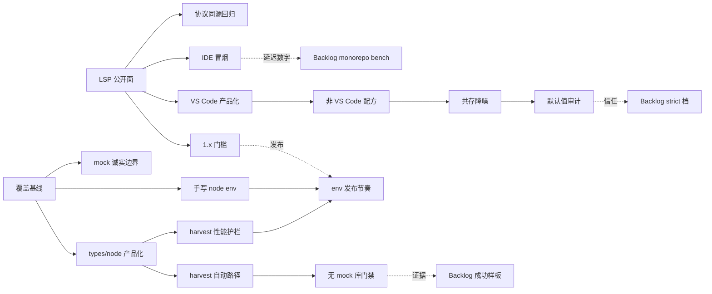

# Close Remaining DX Gaps — IDE/LSP 收口 + 生态覆盖

> **状态**：**P0-A A1–A8 + P0-B B1–B8 已交付**（2026-09-19 实施完成）。
> 证据见各任务表 `[x]` 行；门禁：`pnpm run lint` / `lint:tests` / `coverage:env` /
> 相关 vitest 均绿。Backlog S1–S5 未开工（按拍板押后）。承接
> [`2026-05-28-close-ts-dx-gaps.md`](./2026-05-28-close-ts-dx-gaps.md)
> 主体已交付后的**剩余挑战项**——不是重述已实现设计。
>
> **节奏假设**：**无固定周期**。只排优先级与依赖；按 capacity 拉取任务。
> 与旧路线图冲突时**以本文为准**，并在旧文加指针。
>
> **本轮优先突破口（已拍板）**：
> 1. **P0-A** IDE / LSP 产品化收口（可日用 → 可严肃依赖）
> 2. **P0-B** 生态与 Node / `@types` 覆盖（减少 mock，提升「打开就能推」）
>
> **非本轮优先（仍追踪，见 §4 Backlog）**：真实 monorepo 性能基线、
> 近 strict 默认门禁档、公开成功样板。

---

## 0. 定位与真理源

| 关系 | 文档 |
|------|------|
| 类型本体 | [`design-kernel-merge.md`](../../design-kernel-merge.md) — Abs 单轨 |
| 已交付 DX 路线 | [`close-ts-dx-gaps.md`](./2026-05-28-close-ts-dx-gaps.md) — A–F 主体 `[x]` |
| 精度边界 | [`design-limitations.md`](../../design-limitations.md) |
| 版本与成熟度 | [`versioning.md`](../../versioning.md) |
| vs TS 定位（诚实边界） | website `guides/vs-typescript.md` / `guides/coexistence.md` |

**成功总判据（本轮）**

| 判据 | 度量 |
|------|------|
| IDE 可严肃依赖 | `@nudojs/lsp` 公开面冻结清单落地；1.x 发布说明含 breaking 表；VS Code 扩展与 LSP 同源同版本策略 |
| 非 VS Code 日用 | Neovim / Helix / Zed 配方可复制；矩阵 Known gaps 每条有 workaround + 跟踪 issue/文档锚 |
| 与 tsserver 共存噪声可控 | 文档给出 `analysis.include/exclude` 默认配方；打开 mixed JS/TS 仓不出现「双重错误风暴」的可复现步骤 |
| Node API 可解析率上升 | fixture 套件上：`@nudo:env node` + harvest 后，高频 API `unknown` 叶子占比有基线数字并可回归 |
| 常见库无 mock 可分析 | zero-FP 套件扩展后，至少 N 个 JS 库在 **无手写 mock** 下 infer/check 可跑通且 error 误报仍为 0 |
| 覆盖率可被客观看见 | CI 产出 env/harvest 覆盖报告（resolved / unknown / mock-required） |

---

## 1. 现状锚点（开工前事实）

以下来自仓库实测/文档，**不要凭感觉回退重做**：

### IDE / LSP

| 项 | 现状 |
|----|------|
| `@nudojs/lsp` | **0.8.0**（pre-1.x；公开面未按 1.x SemVer 冻结） |
| `nudo-vscode` | 0.3.5，private；Marketplace 发布链路已在 release.yml |
| 分析默认 | `DEFAULT_ANALYSIS_MODE = "exports"`（`service/evaluator/config.ts`） |
| 能力面 | diagnostics pull/push、hover、completion、CodeLens、inlay、definition/references/rename、signature help、code actions、semantic tokens、`nudo.*` executeCommand、`nudo/…` custom request |
| 同源 | LSP / CLI / agent 经 `AGENT_TOOL_SOURCES` 与 `interfaceTierOf` 钉住 |
| 客户端矩阵 | website `guides/lsp-clients.md` 已有 Y/C/N 表 + Known gaps |
| 未做 | LSP **1.x 公开 API/协议冻结**；扩展与 LSP 的版本对齐策略未产品化；真实大仓 IDE 延迟无产品级基线（与 Backlog B6 相关） |

### 生态 / env / harvest

| 项 | 现状 |
|----|------|
| `@nudojs/env` | 0.3.0；手写 `es` / `web` / `node` Abs 原生模块 |
| node env 覆盖 | 已有 `process`/`Buffer`/`fs` 同步读写/`path` 等；**流、events、完整 async fs、util/url/crypto 等仍偏薄** |
| `@nudojs/harvester` | 0.2.5；`harvestDts` + `emitEnvModule`；已处理 `@types/node` 24/25 path 形态等边角 |
| harvest @types/node | `service/harvest-node.ts` 存在，**有时间/文件数预算**；CI 无 `@types/node` 时 soft-skip |
| 真实包精度 | `check-real-packages`：commander / escape-string-regexp / is-plain-obj / debug / yocto-queue / p-limit / kleur / eventemitter3 / ms / lodash **零误报**（有 JS 源码路径） |
| 未做 | **覆盖报告**（哪些 API 仍 unknown）；`@types/node` 产品化预置/缓存；常见库「无 mock 可分析」门禁；harvest 大包性能门禁 |

---

## 2. P0-A — IDE / LSP 产品化收口

> **一句话**：把「LSP 可用」升格为「团队可以把 Nudo IDE 当日用基础设施」。
> **不做**：重写语言服务；挑战 tsserver 的 TS 语义；为 Helix 实现客户端 UI。

### 任务表

| ID | 任务 | 验收 | 依赖 | 状态 |
|----|------|------|------|------|
| **A1** | **LSP 公开面清单与冻结**：列出必须稳定的表面——npm exports、`nudo-lsp` bin、initialize capabilities、`nudo.*` commands、`nudo/…` requests、CheckJson/agent tool schema | 产出 `packages/lsp/PUBLIC_API.md`（或 website `api/lsp.md` 专节）；每项标注 stable / experimental | — | [x] evidence: `packages/lsp/PUBLIC_API.md`（exports/bin/capabilities/`nudo.*`/`nudo/…`/AGENT_TOOL_SOURCES/CheckJson·InferJson/stable-vs-experimental）；`packages/lsp/src/public-api.ts` 机读清单；website `packages/website/docs/api/lsp.md` §Public API freeze surface 链接并摘要 |
| **A2** | **1.x 发布门槛**：按 `docs/versioning.md` 为 `@nudojs/lsp` 写 breaking 波次表；changeset 模板；**是否进 1.0 由 A1 清单冻结 ≥1 个 minor 周期无 unplanned break 再切** | `versioning.md` 增补 lsp 1.x 草案；CHANGELOG 风格对齐 core/service 1.0 | A1 | [x] evidence: `docs/versioning.md` — maturity 表更新为 lsp **0.8.0** pre-1.x + 1.x gate（PUBLIC_API 观察、**不**自动 bump）；env **0.3.0** / harvester **0.2.5** B8 策略；「IDE / agent surface」breaking 波次表扩展（slash 契约/别名/CheckJson·InferJson/default flip/lsp 1.x cut）。未改任何 package.json 版本 |
| **A3** | **VS Code 扩展产品化**：扩展版本与 bundled `@nudojs/lsp` 对齐策略；Marketplace/Open VSX release notes 模板（默认 analysis.mode、escape hatch、与 tsserver 共存）；activation / documentSelector 与 `shouldAnalyzeFile` 文档一致 | 发布检查清单进 `packages/vscode/` 或 website `guides/vscode.md`；一次 dry-run packaging 通过 | A1 | [x] evidence: `packages/vscode/RELEASE_CHECKLIST.md`（bundled server align · analysis.mode+escape hatch · tsserver 共存 · packaging dry-run 命令与勾选 · Marketplace/Open VS X 模板 · post-release）；website `guides/vscode.md` §Release checklist + activation vs analysis gate。dry-run **未在本机执行 vsce package**（清单含命令；需 release 机跑） |
| **A4** | **非 VS Code 日用配方**：把 lsp-clients.md 的 Setup notes 落成可复制最小配置（Neovim lspconfig、Helix languages、Zed secondary server）；Known gaps 每条 → workaround + 跟踪锚 | 网站矩阵与 setup 可按文档从零配通 diagnostics+hover；gaps 表无「空白格」 | A3 | [x] evidence: en+zh `lsp-clients.md` — Neovim（0.11 `vim.lsp.config` + legacy lspconfig）、Helix languages.toml、Zed settings+lsp binary；Known gaps 每行 workaround + tracking（client limitation — no tracking issue / 文档锚 / coexistence 锚）。en+zh 同步 |
| **A5** | **与 tsserver 共存噪声配方**：默认推荐 `nudo.analysis.include/exclude` + diagnostics 档；说明何时用 `mode=directives` 降噪；mixed 仓打开步骤 | `guides/coexistence.md` + `guides/lsp-clients.md` 同一配方；issue 模板/FAQ 指向该节 | A4 | [x] evidence: en+zh `coexistence.md` — Recipe 2 推荐 include/exclude（含 `**/*.ts` 等）+ 键表；「When to use directives vs exports」；`{#recipe-mixed-js-ts-no-double-error-storm}` 八步无双重错误风暴；lsp-clients Known gaps 指向该锚 |
| **A6** | **IDE 日用冒烟**：选定 1 个含 export 的中型 `.js` 目录（可用 monorepo 内 examples/mini-repo 或 vendored fixture）；记录 open→首诊断、hover、CodeLens、rename、sidecar go-to-def | 结果写入 `packages/lsp/` 测试说明或 website；**不要求**与 tsc 比速（那是 Backlog） | A1 | [x] evidence: `packages/lsp/src/__tests__/ide-daily-smoke.test.ts` — `shouldAnalyzeFile`+`analyzeFile` 导出 fixture、非 export 静默、`getHoverAtPosition`+`collectAbsInlays`+`hoverTool`、local + sidecar `resolveDefinitionLocations`；结果摘要在 `packages/lsp/PUBLIC_API.md` §8。**7/7 pass** |
| **A7** | **协议/命令一致性回归**：确认 agent 工具、LSP executeCommand、CLI 对同一文件的 check/hover/interface 输出仍同源；补缺失 pin | 现有 `AGENT_TOOL_SOURCES` 测试绿；缺的 surface 补测试 | A1 | [x] evidence: `packages/lsp/src/public-api.ts` + `packages/lsp/src/__tests__/public-api-surface.test.ts` — executeCommand ⊇ slash-form（`nudo/X`↔`nudo.X`）、别名解析、AGENT_TOOL_SOURCES keys=文档 tools+codeLens、PUBLIC_API.md 覆盖清单、package.json surface 一致；`agent-lsp-parity.test.ts` 仍绿。server.ts 改为 import `NUDO_EXECUTE_COMMANDS` |
| **A8** | **诊断噪声默认值审计**：无指令、仅 export、含侧车三类文件在 defaults 下的诊断集合有快照测试；防止「以后默认变严」无 changeset | 金样例或 snapshot 测试；breaking 时强制 major（versioning 已写） | A5 | [x] evidence: 扩展 `packages/service/src/__tests__/config-analysis.test.ts` — `GOLDEN_DEFAULT` 全字段（mode=exports, diagnostics=default, evalMissingSlot=off, callSiteBudget=3, exclude=node_modules/dist/coverage）；directives→errors 且 evalMissingSlot 仍 off；空 exclude 回落安全默认。文件检测：`packages/service/src/__tests__/analysis-scope.test.ts`（export 分析 / 非 export 不分析 / node_modules exclude even in all）。coverage 写入 PUBLIC_API.md §7；versioning 已写 default flip= major |

### P0-A 依赖链

```
A1 ──► A2
 │
 ├──► A3 ──► A4 ──► A5 ──► A8
 │
 └──► A6
 └──► A7
```

### P0-A 明确非目标

- 不承诺「IDE 性能全面优于 tsserver」
- 不在本阶段把 `nudo-vscode` 强行 semver 1.x（private，跟 Marketplace notes）
- 不为客户端不支持的 UI（Helix CodeLens）做服务器端假渲染

---

## 3. P0-B — 生态与 Node / `@types` 覆盖

> **一句话**：让常见 Node/JS 依赖在**尽量少 mock**的前提下被分析；
> 并且**覆盖率可度量、可回归**。
> **不做**：完整 soundness checker；动态 `require` 全解；把 `.d.ts` 变成主类型模型。

### 任务表

| ID | 任务 | 验收 | 依赖 | 状态 |
|----|------|------|------|------|
| **B1** | **覆盖基线报告**：定义 fixture 套件（Node 高频 API + 已有 zero-FP 库 + 若干无 `@types` 的 JS 库）；输出 resolved / unknown / mock-required 比例 | 脚本 + 机器可读 JSON/Markdown 进 CI artifact；首份基线入库 `docs/` 报告目录约定（报告态，脚本生成） | — | [x] evidence: `scripts/env-coverage-baseline.ts` + `pnpm run coverage:env` → `docs/reports/env-coverage-baseline.{json,md}`（首份：node resolved 48/50, mock-required 2） |
| **B2** | **`@types/node` harvest 产品化**：稳定入口（CLI 或 service API）；磁盘缓存（避免每次预算截断）；失败时降级到手写 `env/node`；**有 `@types/node` 的 CI 必须跑 hard gate**，无则 skip 并标记 | `harvest-node` 测试从 soft-skip 变为条件 hard；文档写清安装 `@types/node` 后的行为 | B1 | [x] evidence: `harvest-node.ts` 进程缓存 + `clearNodeHarvestCache`/`stats`/`NUDO_HARVEST_NODE=off`；`harvest-node.test.ts` HARD when `@types/node` present / graceful skip when absent |
| **B3** | **手写 node env 补齐高频缺口**（与 harvest 互补，不互相覆盖冲突）：优先 `path`/`url`/`querystring`/`events`/`util`/`stream` 骨架、`fs.promises` 常用方法、`process.env` 槽位 | 以 B1 报告中 top unknown 为 backlog；每项有 Abs 测试；zero-FP 不回归 | B1 | [x] evidence: `packages/env/src/node.ts` + events/util/stream/querystring/fs.promises；tests `packages/env/src/__tests__/node-env-gaps.test.ts` |
| **B4** | **harvest 自动路径**：import 的 npm 包有 JS 源码 → 直接求值；有 `.d.ts` → harvest；两者皆无 → 明确 mock 提示 | fixture：`commander`（源码）/ 典型 `@types` 包 / 纯 JS 无 types 包 三态文档化 + 测试 | B2 | [x] evidence: `harvest-auto.test.ts` 三态用例；docs EN/zh `api/harvester.md`「Automatic harvest path (three states)」 |
| **B5** | **常见库无 mock 可分析门禁**：在现有 real-packages 精度套件上增加 **infer 可跑通**（不仅 check 零误报）——调用点/entry 签名可归纳、关键 API 不整页 `unknown` | 扩展 `check-real-packages` / 新增 coverage 用例；FP 仍锁 0 | B1, B4 | [x] evidence: `packages/service/src/__tests__/infer-real-packages.test.ts`（ms/commander/escape-string-regexp/debug：checkSource FP=0 + analyzeFile 不抛错）；既有 `check-real-packages`/`check-real-commander` 仍绿 |
| **B6** | **手写 mock 文档诚实边界**：website semantics / env 指南列出「仍建议 mock」清单（native、动态导出、流机器回调等） | 与 `design-limitations.md` §八 调用点天花板对齐，不超前吹 | B1 | [x] evidence: semantics EN/zh「Mock boundary」；harvester API mock 边界节；`design-limitations.md` §八 指针表 |
| **B7** | **harvest 性能护栏**：大 `.d.ts`（typescript 本体量级）不拖垮 IDE 启动；预算超时可解释（warning 码），不静默半截 | bench 或集成测试；产品路径默认预算文档化 | B2 | [x] evidence: defaults `HARVEST_NODE_DEFAULT_MAX_FILES=12`/`MAX_MS=2500`；test maxFiles budget + maxMs=0 no-throw；website harvester「Performance budgets」 |
| **B8** | **env/harvester 版本与发布**：`@nudojs/env` / `@nudojs/harvester` 进入「可被 service/cli 钉住的 minor」节奏；覆盖报告数字进 release notes 可选节 | changeset 流程；versioning.md 点名两包策略 | B2, B3 | [x] evidence: `docs/versioning.md` subsection **Ecosystem packages (env / harvester)**（未 bump package.json versions） |

### P0-B 依赖链

```
B1 ──► B2 ──► B4 ──► B5
 │       │
 │       └──► B7 ──► B8
 │
 ├──► B3 ──► B8
 │
 └──► B6
```

### P0-B 建议覆盖优先级（由 B1 基线动态排序，以下仅为默认猜想）

1. Node：`fs/promises`、`path` 全常用、`url`/`URLSearchParams`、`events`、`util`、`stream` 骨架、`crypto` 常用 hash/randomUUID  
2. Web（若 JS 包偏前端）：`URL`、`fetch`/`Response`、`AbortController`（env/web 已有则标「已覆盖」）  
3. 库：保持 zero-FP 名单，扩展 infer 覆盖，而非无脑扩大扫描面  

### P0-B 明确非目标

- 不把 harvest 产物当 Abs 真相（仍是 env 侧信道；与 kernel 文档一致）
- 不自动 `@types/*` 无限解析进 IDE 启动路径
- 不在本轮做「一键生成整个 DefinitelyTyped」

---

## 4. Backlog — 本轮不优先，但必须可追踪

| ID | 项 | 为何押后 | 重新拉起条件 |
|----|----|----------|--------------|
| **S1** | 真实 monorepo cold/warm/edit 基线（原 close-ts-dx-gaps **B6**，已 cancelled） | 用户优先 IDE+生态；无基线不阻塞 A1–A5 文档收口 | P0-A 收口后，若采购/采用卡在「性能没证据」 |
| **S2** | 近 strict 默认门禁档 / 官方契约模板包 | 不违背 C0「不发明义务」前提下设计成本高 | 侧车手写成本成为采用阻塞（用户反馈） |
| **S3** | 公开成功样板（2–3 个真实 JS 包迁移故事） | 依赖 P0-B 可分析度 + S1 证据更完整 | 覆盖报告达标且有外部包愿意公开 |
| **S4** | `analysis.mode=all` 在大仓的 IDE 体验 | 默认 `exports` 已是产品选择 | 有明确用户群需要脚本级全量分析 |
| **S5** | 闭包跨调用状态合流等 limitations P2 | 与 IDE/生态门槛正交 | 精度成为 check 漏报主因时 |

---

## 5. 跨工作流依赖与顺序建议

**无固定周期**下的建议拉取顺序（可并行处已标）：

1. **B1**（覆盖基线）∥ **A1**（LSP 公开面）— 无相互阻塞  
2. **A2/A3**（版本与扩展清单）∥ **B2**（@types/node 产品化）  
3. **A4–A5**（客户端与共存配方）∥ **B3/B4**（env 缺口 + harvest 自动路径）  
4. **A6–A8**（冒烟与默认值审计）∥ **B5–B7**（库门禁与性能护栏）  
5. **B8**（env/harvester 发布节奏）  
6. 视采用反馈再拉 **S1–S3**



---

## 6. 风险

| 风险 | 缓解 |
|------|------|
| LSP 过早 1.0 导致 breaking 束缚 | A2 允许 experimental 区；冻结观察期后再切 major |
| harvest 预置 env 与手写 env 双真相 | 明确加载优先级：项目 `@nudo:env` / 手写 → harvest 补洞 → unknown；冲突时手写 wins 并 warning |
| 覆盖率数字被当成 soundness 承诺 | 报告标题写清「解析率非完备性」；website 措辞与 B6 一致 |
| IDE 配方文档与实现漂移 | A4 配方以 `package.json#nudo.analysis` 与 lsp-clients 为真理源；文档-only PR 也跑链接/矩阵检查 |
| zero-FP 回归 | B3/B5 每步必跑 `check-real-packages` / commander 锁 |
| 范围蔓延成重做 TS 生态 | 每任务必须落在 A1–A8 或 B1–B8；新增愿望进 Backlog |
| 双路线图叙事分裂 | 旧文顶部加指针；冲突以本文为准 |

---

## 7. 与旧路线图的映射

| 本文 | 旧文（close-ts-dx-gaps） |
|------|--------------------------|
| A1–A8 | 收口 **A. IDE 产品化** 未产品化部分 + **E4/E5/E6** 的发布/矩阵残留 |
| B1–B8 | **E 生态与共存** 的深度化；可行性报告下一步（人工金标、`@types/node`、CI） |
| S1 | **B6**（曾 cancelled） |
| S2–S3 | 对话层「能否挑战 TS」结论中的产品/市场缺口，非内核缺口 |
| 非目标重申 | 条件类型语言、`.d.ts` 主模型、大 TS monorepo 一键迁移 |

---

## 8. 更新约定

- 新开工：状态 `[~]` + 一行锚点（PR / issue / 测试名）  
- 完成：`[x]` + 验收证据（报告路径 / 测试 / 文档 URL）  
- 取消：`[-]` + 原因一行（禁止静默删除）  
- 与 `design-limitations.md` 冲突：更新的那篇为准，另一篇加指针  
- 覆盖率基线数字更新：**只改报告文件/生成脚本产物**，不手工改结论段  

---

## 9. 快速开工包（第一周可拉取项）

即使无固定周期，下列五项可以立刻开工且互不阻塞：

1. **A1** 起草 `@nudojs/lsp` 公开面清单（只读盘点 + 文档 PR）  
2. **B1** 覆盖基线脚本骨架 + 对现有 env/node / zero-FP 库跑首份 JSON  
3. **B2** 本机安装 `@types/node` 后 hard-gate 测试草案  
4. **A4** 把 Neovim/Helix 配方从矩阵 Setup notes 收成「最小可运行」一节  
5. **B6** 列「仍建议 mock」诚实清单（对照 limitations §八）  

完成标准不是「功能全上」，而是：**公开面清单 + 覆盖数字 + 一条 IDE 配方** 先落地，后续任务有钉子可敲。
